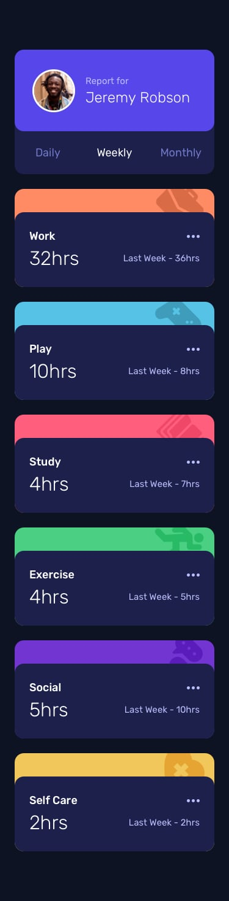
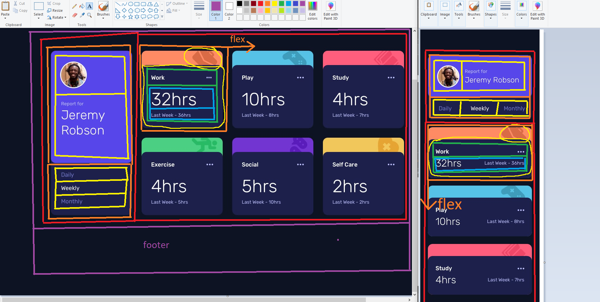

# Frontend Mentor - Time tracking dashboard solution

This is a solution to the [Time tracking dashboard challenge on Frontend Mentor](https://www.frontendmentor.io/challenges/time-tracking-dashboard-UIQ7167Jw). 

## Overview

### The challenge

Users should be able to:

- View the optimal layout for the site depending on their device's screen size
- See hover states for all interactive elements on the page
- Switch between viewing Daily, Weekly, and Monthly stats

### Screenshot

### Links

- Solution URL: [Github](https://github.com/jeremylloyd/frontend-mentor-time-tracking-dashboard)
- Live Site URL: [Github Pages](https://jeremylloyd.github.io/frontend-mentor-time-tracking-dashboard/)

## My process

### Built with

- HTML
- CSS
- Vanilla JS
- Some help from a friend

### What I learned

- Before starting the HTML/CSS, think about all the layouts for each media query and create HTML elements that can be adjusted to fit each layout
  
  - I started out this project by starting with the mobile view, before realising that the components I had chosen wouldn't easily work for the desktop layout
  - Save time by planning first
- When adjusting CSS for a media query, it's easy to create new rules that conflict with the default CSS rules, resulting in you not getting the exact layout you want. I found that by copy-pasting all the default rules into the media query then unsetting or deleting rules that aren't needed, I can generally avoid rule conflicts.
- Use id for unique items (e.g. the Work category) and classes for common properties (e.g. a stat panel)